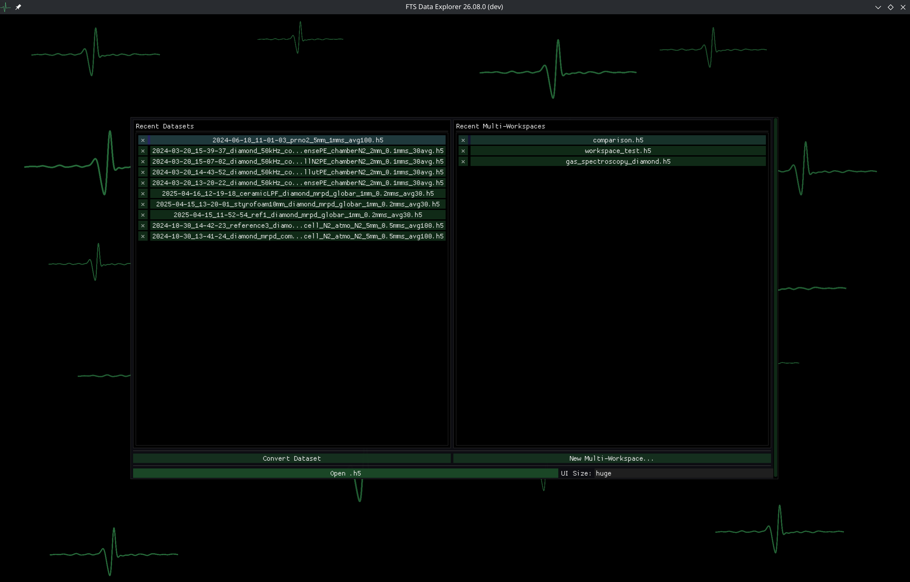
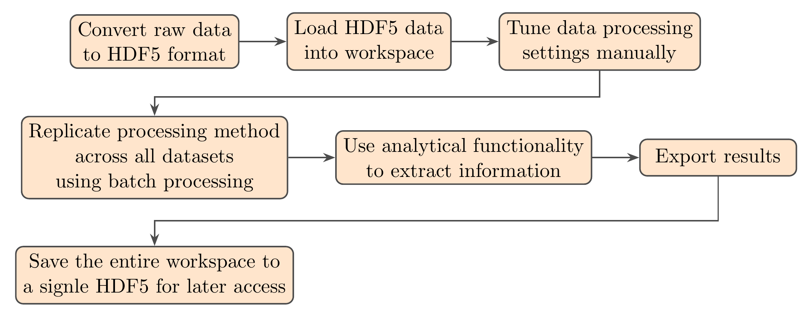
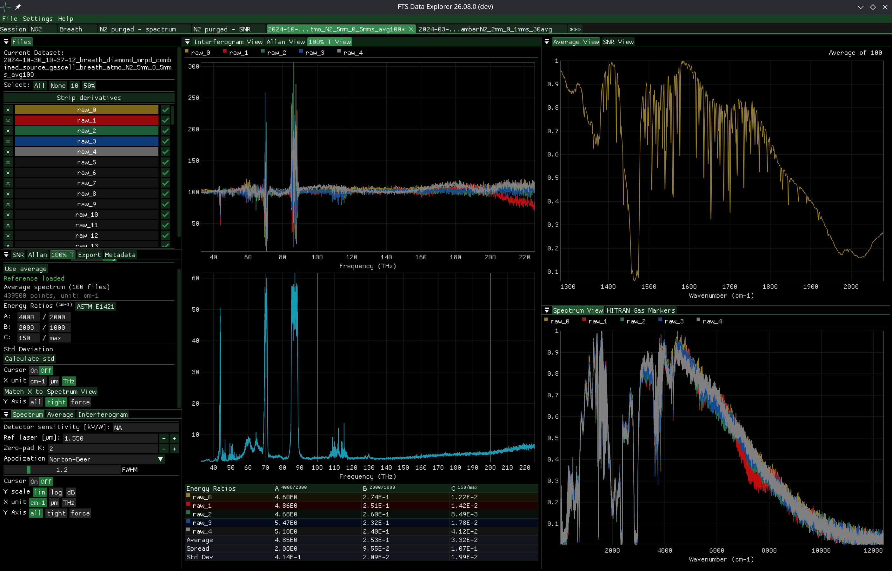
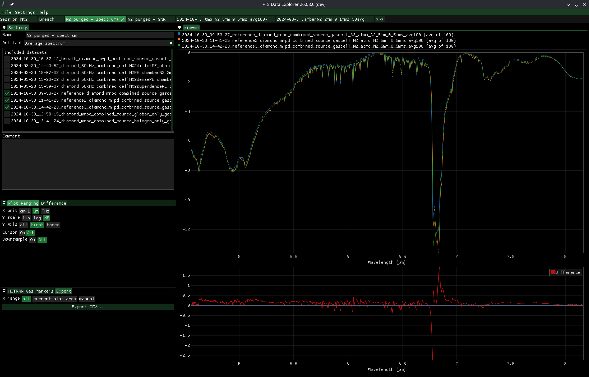
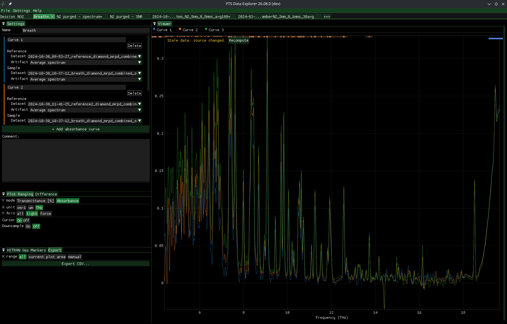
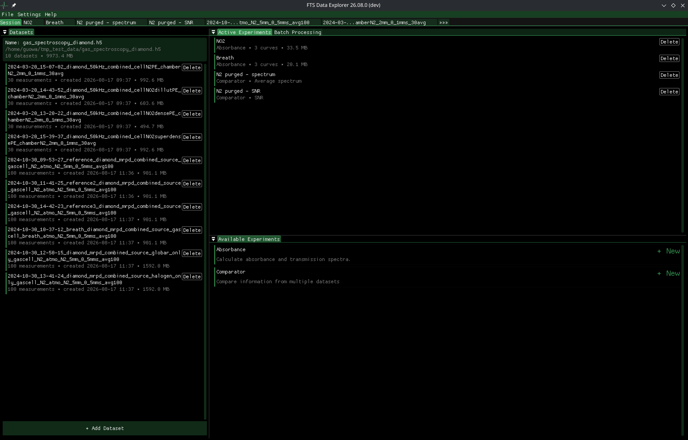

# FTS Data Explorer

A free and open source scientific application for rapid exploration of raw data produced by Fourier spectrometers.
Almost dependency-free builds are available for Linux and Windows.

[](https://github.com/jmnich/fts_data_explorer/releases/latest)



## The pitch

It is a long-standing tradition to ship spectrometers with old, glitchy, almost useless
software. FTS Data Explorer cannot solve your problems with extracting raw data from
instruments but it will help you rapidly process and analyze it to produce useful insights.
Lightning-fast multithreading and an FFTW3-powered math engine with GPU-accelerated plots
save you time and frustration and preserve your focus for things that actually matter.

The application is designed to help with handling data from DIY lab instruments but can be
adapted to load raw interferograms and spectra in almost any form.

## Workflow

Data must be delivered in a compliant HDF5 (.h5) format. Non-compliant sources must first be
converted using the built-in data adapter solution invoking external python scripts. Such
prepared data is loaded into a workspace where processing settings can be tuned by hand. Once
a method works, it is replicated across all datasets with batch processing and analytical
features allow you to quickly extract the information you need. Results are easily exported
to .csv for further analysis or publication. The entire workspace is saved back to a single
HDF5 file for later access and archiving.



## Features

**Performance & portability** — fully C++, multithreaded to all CPU cores, FFTW3 math
engine, GPU-accelerated plotting; ships as static executables (native Linux build,
MinGW cross-compiled Windows build) with no installation requirements.

**Data handling** —
- Workspaces in a unified, self-describing HDF5 container (`.h5`): every artifact, plot
  setting, comment and metadata round-trips in a single copyable file.
- Foreign data enters through the built-in **Conversion screen** with scripted converters
  (WUST raw CSV, ArcOptix IGMs and spectra), extensible via self-contained `.py` converters
  from the [converters repo](https://github.com/jmnich/fts_data_explorer_converters) or a
  local user directory.
- Everything visible on screen can be exported to `.csv`.

**Spectrum processing** —
- Dual-interferogram (reference + primary) input with Hilbert-transform and peak-finding
  X-axis correction, adjustable reference laser wavelength.
- Full control over zero-padding, parametric apodization windows (Norton-Beer,
  Dolph-Chebyshev, Hamming, Blackman-Harris, Happ-Genzel, …) and detector sensitivity.
- Switchable x-axis (cm⁻¹, µm, THz) and y-axis (lin, log, dB).
- Raw measurements can be selectively included, excluded or deleted from any calculation.



**Spectral data processing** — many calculation artifacts are available: average spectrum,
spectral SNR, 100 % transmission line with standard deviation and ASTM E1421 energy ratios,
and 3D Allan variance plots from either T100 % lines or spectral brightness to find the
optimal integration time.

HITRAN gas markers may be invoked for 8 popular gases in overlay on any spectral plot to help
distinguish real features from interference.

**Experiments** — cross-dataset analyses in dedicated tabs with results saved as named,
recomputable experiments inside the archive:
- **Comparator** — overlays any artifact (interferograms, spectra, T100 %, SNR, …) between
  datasets, with an automatic difference curve.
- **Absorbance** — absorbance/transmittance of samples against any reference, with
  residual-error curves.





**Workflow tools** —
- **Multi-workspace sessions**: many datasets embedded in one `.h5`, browsed from the
  always-present Session tab; each opens on demand in its own workspace tab. Datasets are
  deep-copied into the archive so experiments survive copying between machines.
- **Batch processing**: apply a processing recipe to every dataset at once — with standard
  recipes, derived ones, and human-readable `.json` import/export.
- Headless mode runs the same calculation engine without the GUI for automated workflows.
- Dockable, resizable interface with dark theme and customizable accent color; persistent
  configuration and recently-opened list make your work faster.



## Building

```
./build_script.sh            # Linux release build (fetches all dependencies)
./build_script.sh -w         # cross-compile the Windows executable
```
