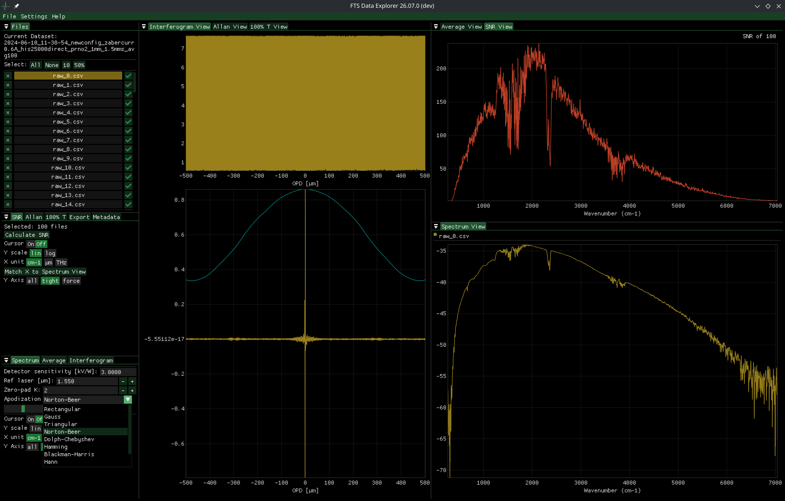
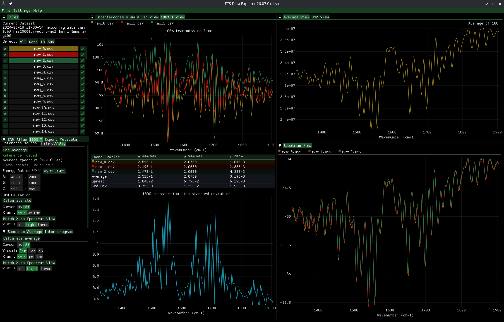
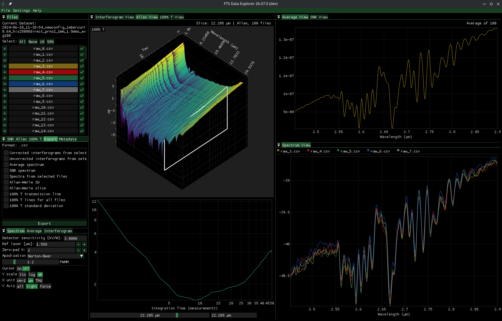
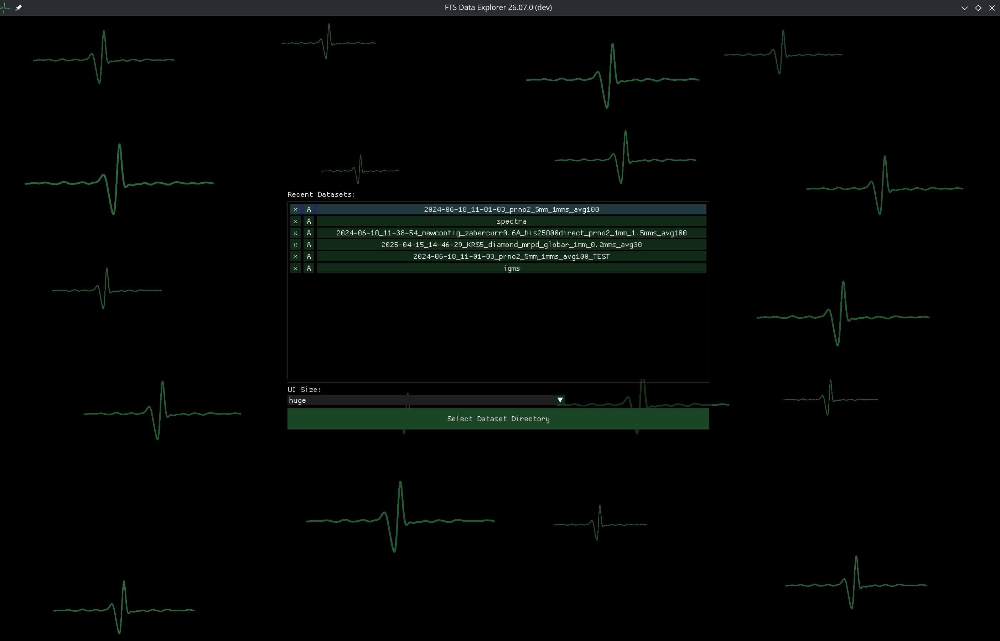

# FTS Data Explorer

A free and open source scientific application for rapid exploration of raw data produced by Fourier spectrometers.
Almost dependency-free builds for Linux and Windows

## The pitch
It is a long-standing tradition to ship spectrometers with old, glitchy, almost useless software. FTS Data Explorer cannot solve your problems with extracting raw data from instruments but it will help you rapidly process and analyze interferograms. Lightning-fast  multithreading, FFTW3-powered math engine with GPU-accelerated plots save you time and frustration, and preserve your focus for things that actually matter. 

The application is designed to help with handling data from DIY lab instruments but can be adapted to load raw interferograms and spectra in almost any form.

## Features

- Docking interface with customizable layout 
- Dark mode (with customizable accent color)
- Switching spectrum x-axis between cm⁻¹, µm and THz
- Switching spectrum y-axis between lin, log and dB
- Flexible data adapter system, allowing for importing raw data in various forms
- Basic plotting of reference and primary detector signals
- Advanced spectrum calculation capabilities giving the user control over zero-padding, apodization, reference laser tuning and detector sensitivity
- Rapid average spectrum calculation
- Spectral SNR calculation
- 100 % transmission line analysis for investigating spectrometer stability with built-in 100 % transmission line standard deviation plotting

- Custom energy ratio calculation with statistics, with presets defined in ASTM E1421 for FTS-MIR
- Allan plots calculated from T100% and spectral brightness to aid you in finding optimal integration time

- Everything that you see on the screen can be exported to .csv
- Headless mode lets you use the application as a shell-operated calculation engine, without GUI, for automation, verification and advanced integration purposes
- Persistent configuration and a recently-opened dataset list

